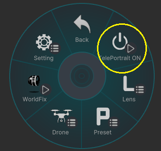

# How to Use

## 使い方
VRCハンドカメラを出し、
エクスプレッションメニューから**[TelePortraitLens]**を選択  
**[TelePortrait ON]**を選択すると、レンズが起動します。  

このカメラオブジェはVR画面上からしか見れません。  
また他の人からも見えません。 

---

## 基本的な撮り方

1. カメラを起動したら、[Lens]-[Focus Range]を選択、被写体との距離に近い数値を選ぶ。
2. [Lens]-[Focus]を選択、上下ボタンで被写体にメインカメラの撮影範囲を合わせる。 
左右で、フォーカス範囲を広げることが可能です。(⇐:範囲拡大 / ⇒:範囲縮小)
3. [Lens]-[FOV]-[Main Fov]で画角を合わせよう。

---

### 異常な撮り方

* [Lens]-[FOV] でForeとBackの画角を **それぞれ** 変更できます。
* [Lens]-[Unit]　で、３つのカメラの設定をそれぞれ変更できます。
* [Lens]-[Unit]-[Fore]-[LayerBlend]で前景の絵をPhotoshopのようなレイヤーブレンドを選べます。  
これにより、前景カメラだけWorldFixで別の場所を写してスクリーンで重ねたりできます。  

* 例えば、頭上に大きな満月があるワールドにて、メインカメラにて正面から人を写しつつ  
背景カメラを頭上の大きな満月に向けてWorldFixをして撮る。  
すると人物の後ろに満月が存在している写真が撮れます。  

---

## 仕様
* ワールドによっては、うまく撮れないところもあります。
* 視界ハックエフェクトがあるワールドでは、ちゃんと撮れないです。
* 試用されているシェーダーによってはきちんと撮れないです。
* ドローン機能はメインカメラにしか使えません。