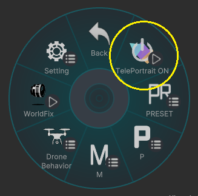
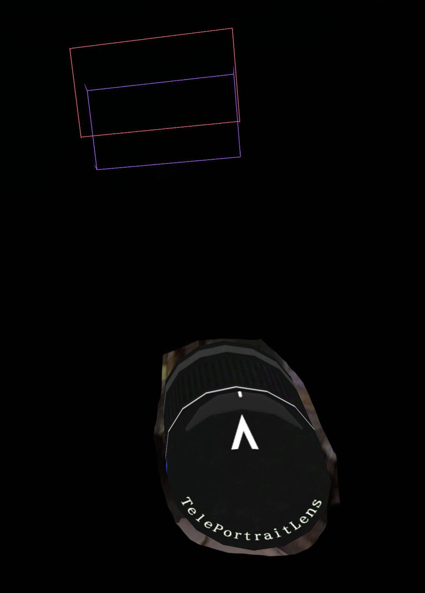
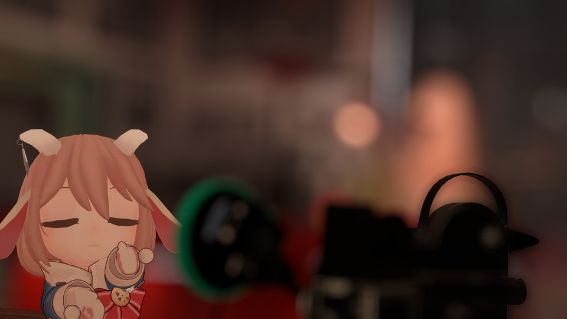
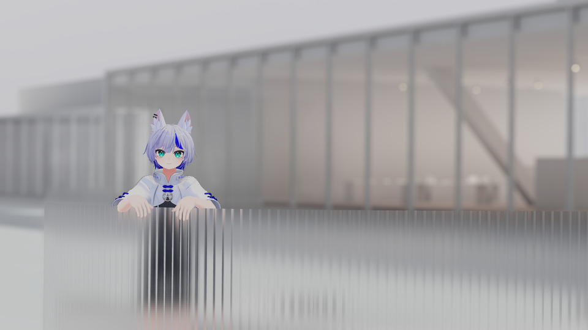

# How to Use

## 使い方
VRCハンドカメラを出し、  
エクスプレッションメニューから**[TelePortraitLens]**を選択  
**[TelePortrait ON]**を選択すると、レンズが起動します。  

レンズを起動させると**カメラのオブジェクト**と  
カメラオブジェクトの視線の先に**２つの四角い枠**が表示されます。  
このカメラと枠は、自分自身からしか見ることができません。  

---

## レンズ位置の調節
[Setting]-[Lens Transform Adjust]で  
レンズの位置と角度を調節できます。  
自身の撮影スタイルに合わせて調節をしてください。  

---

## 基本的な仕様
レンズを起動させるとVRCハンドカメラ上の画面が  
TelePortraitLensの画面になります。  
  
**Tele Portrait Lens**は３つのカメラを使用しています。
**前景（Fore）**・**メイン**・**背景（Back）**の３つを同時に撮影し  
それを合成しています。
  
表示されている**四角い枠組みの中が**メインカメラの撮影範囲になります。  
基本的には枠組みの手前側がForeの撮影範囲 、奥側がBackの撮影範囲になります。
  
ForeとBackの撮影範囲についてはボケが発生します。

つまり撮影したい対象を枠で挟んで撮るのが基本となります。  

---

## 基本的な撮り方

1. カメラを起動したら、[P]-[Focus Range]を選択  
被写体との距離に近い数値を選ぶ。

2. [P]-[Focus]を選択すると、上下左右の4方向に入力できるパッドが表示されます。  
上下ボタンで被写体にメインカメラの撮影範囲を合わせる。  
左右で、フォーカス範囲を広げることが可能です。(⇐:範囲拡大 / ⇒:範囲縮小)

3. [P]-[FOV]で画角を調整しましょう。

4. [P]-[Bokeh]の各数値を変更して、ボケの強さを決めます。

5. Optional:[M]-[各カメラ]-[Color Correction]でカメラの色調補正などができます。  
メインに映っている被写体だけを明るくしたり  
逆に背景を暗くしたりして、被写体を目立たせる事も可能です。

6. 設定をリセットしたい場合には[Preset]の各種[Reset]を活用してください。  
押し間違い防止のために、[Lens]と[Fix&Level]のResetボタンは  
長押しで実行されます。  

---
