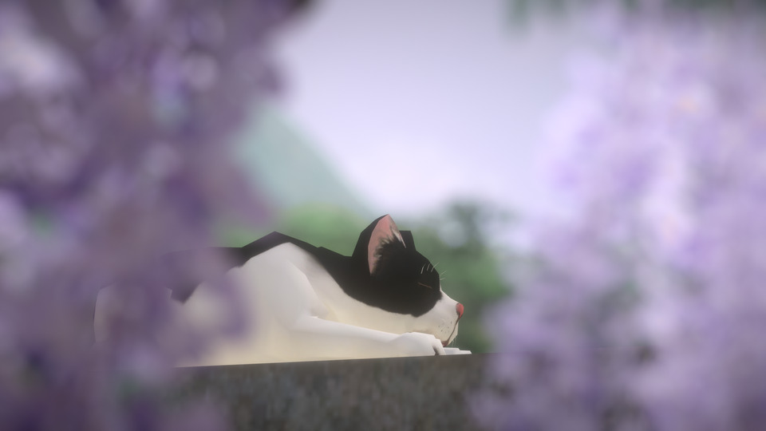
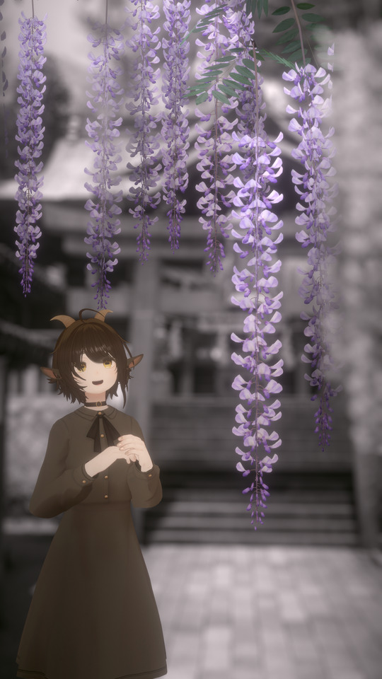

# How to Use2

## 異常な撮り方

* [P]-[Optics] でForeとBackの画角を **それぞれ** 変更できます。
* [P]-[Fore]・[Main]・[Back]で、３つのカメラの設定をそれぞれ変更できます。  
設定は、WorldFixによりカメラをそれぞれ別の場所へ置いたり  
[Color Correction]内で背景を暗くしたり  
前景のコントラストを上げたりする事もできます。  

* [P]-[Fore]-[LayerBlend]で前景の絵をPhotoshopのようなレイヤーブレンドを選べます。  
前景の絵をスクリーン合成したり、乗算合成したりできます。

* 例えば、頭上に大きな満月があるワールドにて  
メインカメラで正面から被写体を写しつつ  
背景カメラを頭上の大きな満月に向けてWorldFixをして撮る。  
すると人物の後ろに満月が存在しているような写真が撮れます。  

---

この写真は、world:Japan Shrine (Creater:RootGentle)にて撮影をしました。  
鳥居の上で寝ている猫を藤の花の隙間から写した写真ですが、  
実地では隙間から猫をこの角度から写せる位置は存在せず、  
3つのカメラをそれぞれ、別の位置に置いて撮影をしています。  

---

前景と背景だけ、彩度を落として撮影する事も出来ます