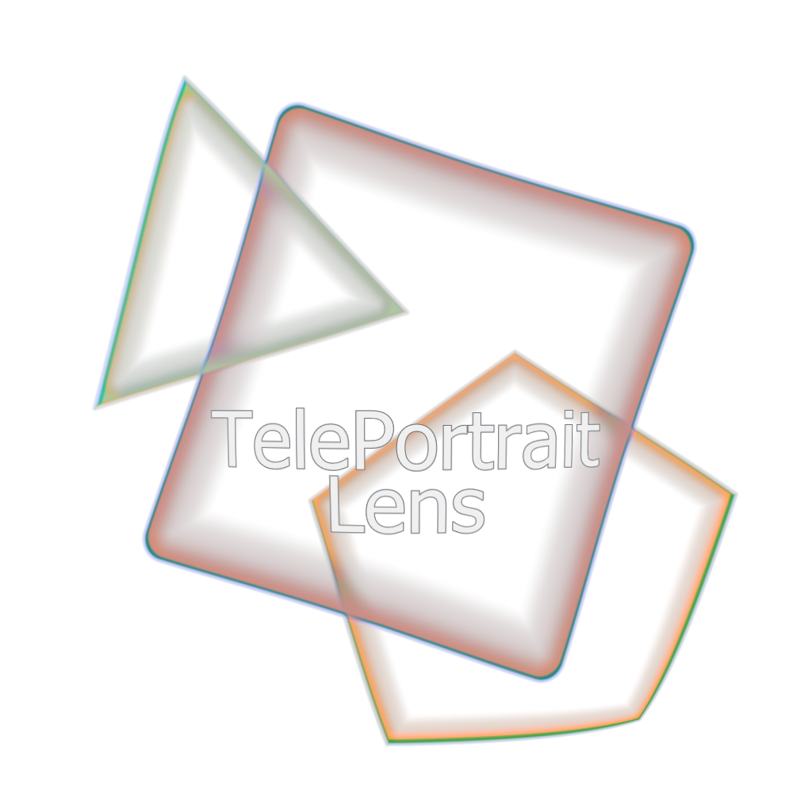

# TelePortraitLens

  

## What's this Camera?

Tele Portrait Lens は、**VRChat アバター向けのカメラギミック**です。  
**ポートレート撮影をしやすくすること** を主目的として制作されています。

本ギミックでは、**3つのカメラ**を使用して  
**前景（Fore）**、**メイン**、**背景（Back）** をそれぞれ個別に撮影し、  
その場で合成しています。

また、**前景** と **背景** には強制的にぼかしが適用されます。  
これにより、通常のカメラではぼかしにくい **エフェクト** や **パーティクル** も、  
自然にぼかして表現できます。

さらに、3つのカメラはそれぞれ個別に制御できます。  
そのため、たとえば **背景だけ画角を変える**、  
**前景を Screen 合成して水面表現を加える** といった演出も可能です。