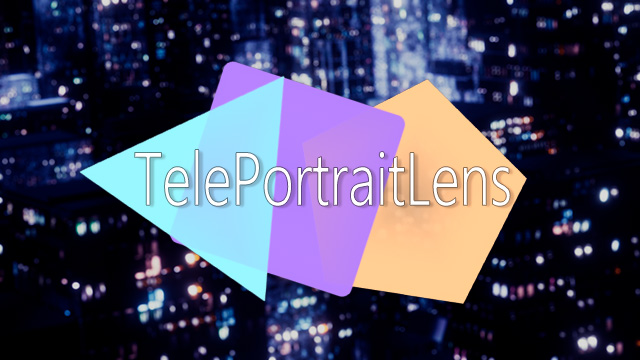
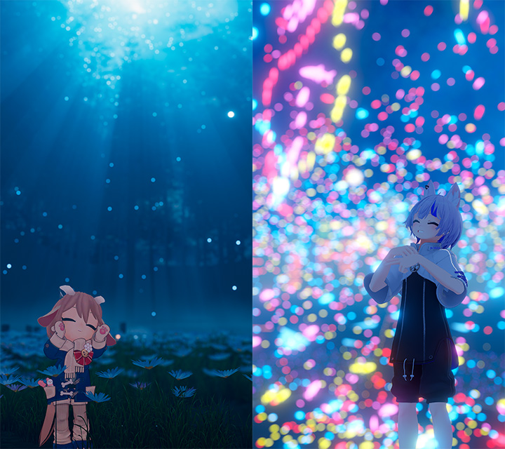
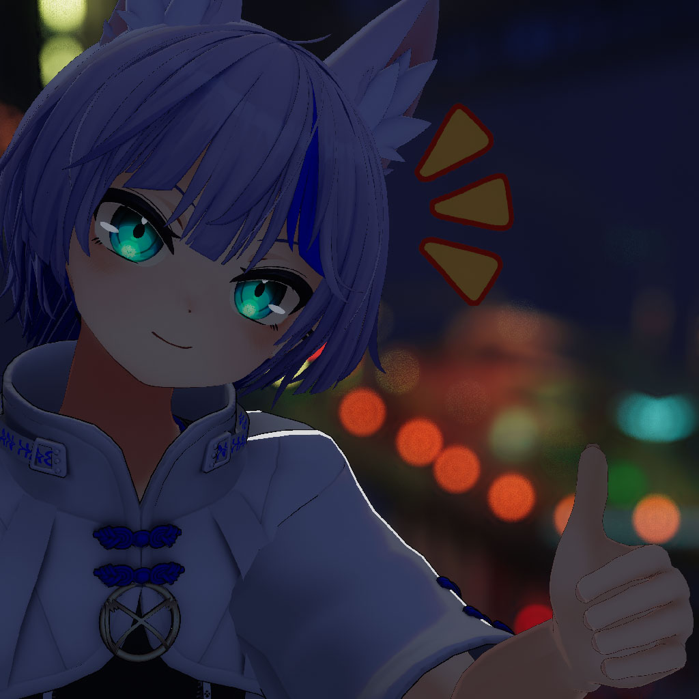

# TelePortraitLens

  

## What is TelePortraitLens?

Tele Portrait Lens は、VRChatアバターに導入して使える**カメラギミック**です。  
**ポートレート撮影をしやすくする事** を主目的として制作されています。

本ギミックでは、**3つのカメラ**を使用し  
**前景（Fore）**・**メイン**・**背景（Back）** をそれぞれ個別に撮影しつつ、  
合成をしています。

また、**前景** と **背景** には強制的にぼかしが適用されます。  
これにより、通常のカメラではぼかしにくい **エフェクト** や **パーティクル** も、  
自然にぼかして表現できます。

PCVRモードのみに対応しています。  
デスクトップモードでは操作できません  

  

さらに、3つのカメラはそれぞれ個別に様々な制御ができます。  
たとえば **背景だけ画角を変える**、  
**前景に水面を写して Screen 合成し、写真に水面表現を加える** といった演出も可能です。
 
---

## 購入前に必ずご確認ください

TelePortraitLens は3つのカメラを使用する特殊なカメラギミックです。
ワールド、シェーダー、視界ハック系エフェクト、Post Effects の影響により、
意図した通りに撮影できない場合があります。

購入前にサンプルアバターで動作をご確認ください。
  
サンプル版は、解像度を製品版の半分である1920x1080にしております。  
 
TPLサンプルアバター  
  

使用させていただいているアバター：-ハオラン-HAOLAN    

## 謝辞
ドローン操作のシステムは  
suzuki_ithさんが制作したカメラドローン操作システムを  
許可を頂きまして参考にさせていただきました。  
誠にありがとうございます。  
  
[【VRChat用】Integral カメラギミック](https://booth.pm/ja/items/4724145)