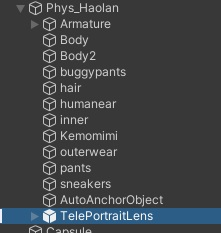
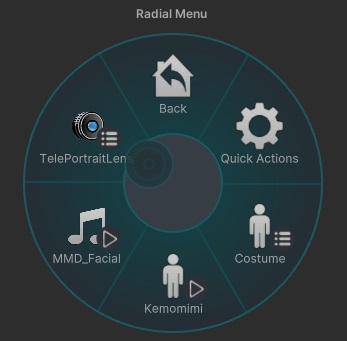

# 導入方法

1.  
Modular Avatar を導入してください。  
最新版の Modular Avatar の使用を推奨します。  
バージョンが古い場合、正常に動作しないことやエラーが発生することがあります。    
[Modular Avatar の導入はこちら](https://modular-avatar.nadena.dev/ja)  
 
2.  
Prefab をアバター直下に配置してください。  
右利きの方は [TelePortraitLens] を使用してください。  
左利きの方は [TelePortraitLens_Left] を配置してください。  

 
3.  
アップロード後、Expressions Menu に [TelePortraitLens] が追加されます。  
