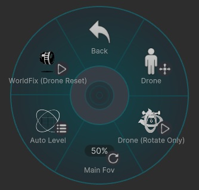

# Drone

レンズをドローンのように操作して移動させる機能です。

## Drone

ドローンモードを起動します。  
**利き手と逆の手** でドローンを移動し、**利き手** でカメラの向きを操作できます。

ドローンモードを終了すると、レンズはその時点の位置で固定されます。

### 操作方法

起動後は、スティック操作で以下のように動作します。

- **左右入力** ：カメラを左右に回転します
- **上下入力中** ：ドローンの移動速度が上がります

---

## Drone (Rotate Only)

ドローンを移動させず、カメラの向きのみを **利き手** で操作できます。

---

## Main Fov

メインカメラの FOV を調整できます。  
**[Sync]** が ON の場合は、他のカメラの FOV にも同期されます。

---

## Auto Level

カメラの傾きを制御します。  
カメラの傾きを **左・正面・右** に固定できます。

---

## WorldFix (Drone Reset)

ドローンを手元の位置に戻します。　　
もしくは空中に固定できます