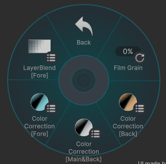

# Effects

## Film Grain
画面にフィルムグレイン効果を追加します。

---

## Color Correction
各カメラで画像補正ができます。  

- **Highlight** : ハイライト部を明るくします(Mainにはありません)
- **Exposure** : 露出コントロール
- **Contrast** : コントラスト
- **Tone Curve** : トーンカーブ
- **Natural Saturation** : 自然な彩度
- **Saturation** : 彩度

---

## LayerBlend[Fore]
前景の合成モードを選択できます。

- **None** ：前景を描画しません
- **Add** ：加算
- **Dodge** ：覆い焼きカラー
- **Normal** ：通常合成
- **Screen** ：スクリーン
- **Multiply** ：乗算

- **Alpha** ：前景の透明度を変更できます

- **Far Clipping** ：前景カメラのFarをSkyBoxまで写せます。

##### 補足

- **Normal以外** を選択した場合  
メインカメラの Near は Fore カメラの Near と同じになります。
- **Normal** 選択時は、透明度の変更はされません(100%固定)。
- **Normal** 選択時は、  
Depth がある部分では前景が通常合成されます。  
Depth がない部分は Screen 合成として扱われます。

 