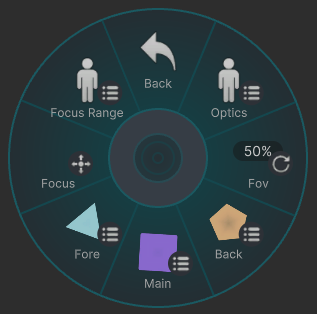
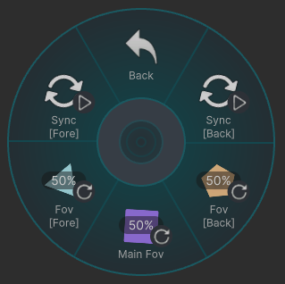
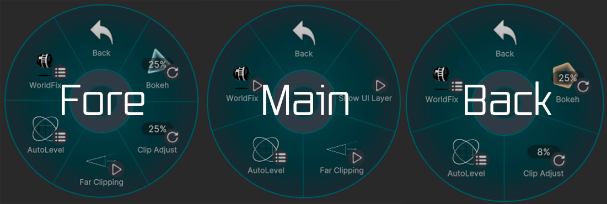
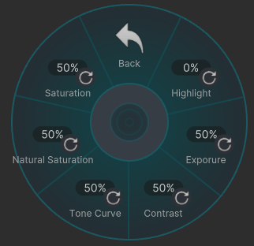
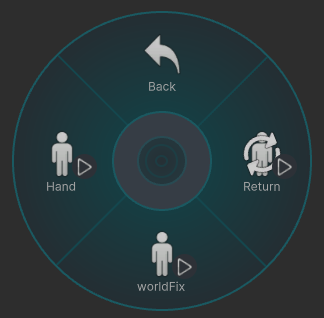
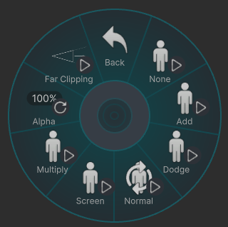

# M - Manual Settings

---
## Optics

カメラの視野角やボケの強さを変更できます。  
FOVの設定範囲は **12mm ～ 1000mm** 相当です。

- **0%** ：12mm
- **25%** ：53mm
- **50%** ：94mm
- **75%** ：135mm
- **100%** ：1000mm

- **[Main FOV]**  
  メインカメラの FOV を変更できます。

- **[Sync]**  
  ON 状態では、メインカメラの FOV と同期します。

- **[FOV [Fore]]** / **[FOV [Back]]**  
  これらを選択すると、対応する **[Sync]** は自動的に OFF になります。

 

---
## FOV

メインカメラの FOV を変更できます。  

  

---
## Fore / Main / Back 

### 共通設定

#### Color Correction
各カメラで画像補正ができます。  

- **Exposure** : 露出
- **Contrast** : コントラスト
- **Tone Curve** : トーンカーブ
- **Natural Saturation** : 自然な彩度
- **Saturation** : 彩度

 

#### AutoLevel

  
各カメラの傾きを **左・正面・右** に固定できます。

 

#### WorldFix

各カメラをワールドに固定できます。  
(Mainだけは下記の様な設定項目に移らず、ワールドに固定されます。)

- **Return** ： メインカメラの位置に戻ります。
- **WorldFix** ： カメラをワールドに固定します。
- **Hand** ： カメラを手元と同期します。

 

---

### Fore

#### LayerBlend
前景の合成モードを選択できます。

- **None** ：前景を描画しません
- **Add** ：加算
- **Dodge** ：覆い焼きカラー
- **Normal** ：通常合成
- **Screen** ：スクリーン
- **Multiply** ：乗算

- **Alpha** ：前景の透明度を変更できます

##### 補足

- **Normal以外** を選択した場合  
メインカメラの Far は Fore カメラの Far と同じになります。
- **Normal** 選択時は、透明度の変更はされません(100%固定)。
- **Normal** 選択時は、  
Depth がある部分では前景が通常合成されます。  
Depth がない部分は Screen 合成として扱われます。

 

#### clip Adjust

Fore カメラの Far の位置を、奥側へ微調整できます。

 

#### Far Clipping

ON にすると、Foreカメラの **Far** が Backカメラの **Far** と同じになります。  
Skyboxを含め、遠景全体を写せるようになります。

---

### Main

#### Show UI Layer

ON にすると、UI Layer を描画できます。(メインのみ)

 

#### Far Clipping

ON にすると、Mainカメラの **Far** が Backカメラの **Far** と同じになります。  
MainカメラではSkyboxは写りません。

---

### Back

#### Clip Adjust

Back カメラの Far の位置を、手前側に微調整できます。

 

---
## Focus

ピントを合わせる距離(フォーカス距離)と、ピントが合う範囲(フォーカス範囲)を  
キーを入力する方向で調整できます。

- **↑** / Farther：フォーカス距離を奥へ移動
- **↓** / Closer ：フォーカス距離を手前へ移動
- **←** / Widen：フォーカス範囲を広げる
- **→** / Narrow：フォーカス範囲を狭くする

 

---
## Focus Range

フォーカス距離を、一定の距離から選択できます。  
フォーカス範囲は **約 1.5m** になります。

### AutoFocus
VRC Raycastを使用して、カメラの中心部分にある **コライダー** にフォーカスを合わせます。  
VRChatの仕様により、自身かワールドのコライダーにしか反応しません。

- AF_DoF では、AutoFocusのフォーカス範囲を調整できます。  
  値を大きくするとピントの合う範囲が広くなります。