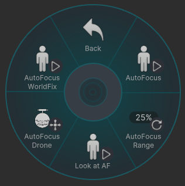

# P - Program Settings

---
## FOV

Mainカメラの視野角を変更できます。  
Fore,Backの視野角も同じになります。(Syncを外していない場合は)
FOVの設定範囲は **12mm ～ 1000mm** 相当です。

- **0%** ：12mm
- **25%** ：53mm
- **50%** ：94mm
- **75%** ：135mm
- **100%** ：1000mm

 

---
## Bokeh[Fore]&[Back]

ForeとBackのボケの強さを変更できます。

 

---
## AutoLevel

  
カメラの傾きを **左・正面・右** に固定できます。

 

---
## WorldFix

カメラをワールドに固定できます。

 

---
## Focus

ピントを合わせる距離(フォーカス距離)と、ピントが合う範囲(フォーカス範囲)を  
キーを入力する方向で調整できます。

- **↑** / Farther：フォーカス距離を奥へ移動
- **↓** / Closer ：フォーカス距離を手前へ移動
- **←** / Widen：フォーカス範囲を広げる
- **→** / Narrow：フォーカス範囲を狭くする

 

---
## Focus Range

フォーカス距離を、一定の距離から選択できます。  
フォーカス範囲は **約 1.5m** になります。  
選択後の細かい調整は [Focus](#focus)で合わせます。

### Auto Focus

AutoFocusを選択すると、利き手と逆の手に**ピンク色の球**が表示されます。  
AutoFocus中は、この球とカメラの距離がフォーカス距離となります。  
  
- **AutoFocus Range** で、AutoFocus中のフォーカス範囲を調整できます。  
値を大きくするとピントの合う範囲が広くなります。
- **Look at AF** で、カメラが常にピンク級の方を向きます。
- **AutoFocus Drone** で、ピンク球をドローンのように  
好きな場所に移動させれます。
- **AutoFocus worldFix**で、好きな場所にピンク球を置いたり  
手元に引き寄せたり出来ます。
  
動かし方はカメラのドローンとほぼ同じです。  
回転機能はありません。