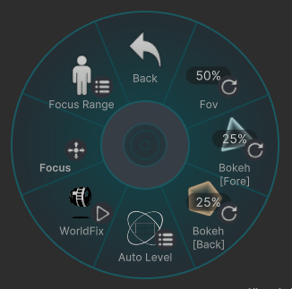
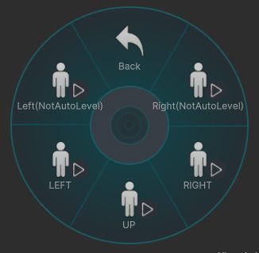
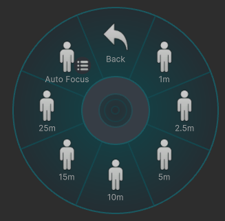

# P

---
## Fov
---

Mainカメラの視野角を変更できます。  
Back,Foreの視野角も同じになります。(Syncを外していない場合は)
FOVの設定範囲は **12mm ～ 1000mm** 相当です。

- **0%** ：12mm
- **25%** ：53mm
- **50%** ：94mm
- **75%** ：135mm
- **100%** ：1000mm

 

## Bokeh[Fore]&[Back]
---

ForeとBackのボケの強さを変更できます。

 

## AutoLevel
---

  
カメラの傾きを **左・正面・右** に固定できます。

 

## WorldFix
---

カメラをワールドに固定できます。

 

## Focus
---

ピントを合わせる距離(フォーカス距離)と、ピントが合う範囲(フォーカス範囲)を  
キーを入力する方向で調整できます。

- **↑** / Farther：フォーカス距離を奥へ移動
- **↓** / Closer ：フォーカス距離を手前へ移動
- **←** / Widen：フォーカス範囲を広げる
- **→** / Narrow：フォーカス範囲を狭くする

 

## Focus Range
---

フォーカス距離を、一定の距離から選択できます。  
フォーカス範囲は **約 1.5m** になります。

### AutoFocus
VRCRaycastを使用して、カメラの中心部分にある **コライダー** にフォーカスを合わせます。  
VRChatの仕様により、自身かワールドのコライダーにしか反応しません。

- *AF_DoF* はAF後のフォーカス範囲をある程度に設定できます。