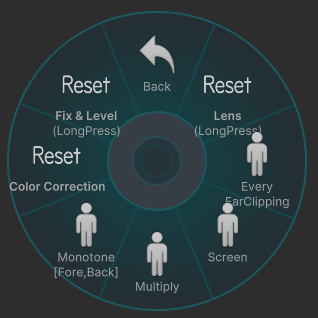

# Preset

## Reset Lens
Lens関連の設定をリセットします。  
(FovやFocusやBokehの設定など)  
この項目を**長押し**で選択するとリセットが実行されます。  

## Enable FarClipping
[Fore]と[Main]の[**Far Clipping**]をONにします。  

## Screen
[Fore]-[LayerBlend]の[**Screen**]をONにします。  
写真を明るくします。  

## Multiply
[Fore]-[LayerBlend]の[**Multiply**]をONにします。  
写真を暗くします。  

## Monotone[Fore,Back]
[Fore]と[Back]の[Color Correction]-[**Saturation**]の値を**0%**にします。  
前景と背景が白黒になります。  

## Reset Color Correction
各カメラの[Color Correction]の設定をリセットします。  

## Reset Fix & Level
各カメラのWorldFix設定と Auto Levelの設定などをリセットします。  
この項目を**長押し**で選択するとリセットが実行されます