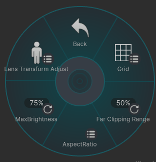
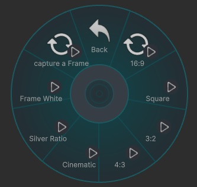
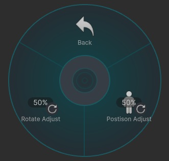

# Setting

---

## Grid

プレビュー画面にグリッドを表示できます。撮影した写真には写りません。   
使用したいグリッドを選択してください。  

---
## Far Clipping [Back]

Backカメラの表示可能距離を調整できます。  
Skybox が映らない場合や、遠方のオブジェクトが表示されない場合は、この値を大きくしてください。

- **0%** ：1km
- **50%** ：10km
- **75%** ：25km
- **100%** ：1000km

---

## Aspect Ratio

指定したアスペクト比で写真を撮影できます。  
フレームの外側は黒で表示されます。**[White Back]** を ON にすると、白で表示されます。

選択できるアスペクト比は以下の通りです。

- **16:9**
- **Square (1:1)**
- **3:2**
- **4:3**
- **シネスコ (2.35:1)**
- **Silver Ratio（黄金比）**

### Frame White

ON にすると、フレームが白になります。

### Capture a Frame

フレームを撮った写真に写すかどうかを切り替えます。  
 

**注1**  
ワールドの Post Effects の設定によっては、黒いフレーム部分にエフェクトがかかる場合があります。  
また、フレームを白にした場合は、写真内部にエフェクトがかかる場合があります。

**注2**  
フレームを白くした状態で VRC+ のプリント機能を使用した場合、  
プリントされた写真の外側の白と、写真内部の白は異なる色になります。  
これは仕様です。

---

## MaxBriightness

元の光が極端に強い場合、ぼかし部分にノイズが入ることがあります。  
その場合は、この値を下げて調整してください。

---

## Lens Transform Adjust

### Posison Adjust

レンズの位置を左右方向に微調整できます。

### Rotate Adjust

レンズの回転を上下方向に微調整できます。