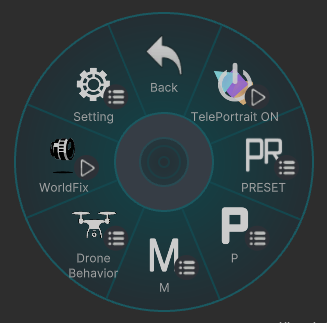

# Menu TOP

## TelePortrait ON
TelePortraitLensを起動します

## PRESET
写り方のプリセットを選べます  
また設定を初期化するリセットもあります  

## P
[Program]  
主要な撮影設定を素早く変更するためのメニューです。

## M
[Manual]  
Fore / Main / Back それぞれの設定を細かく調整するための詳細メニューです。

## Drone Behavior
ドローン移動や、カメラ向きの固定に関する設定を行えます。

## WorldFix
カメラを空中に固定できます。

## Setting
カメラの持ち位置やグリッドなどの設定ができます。

